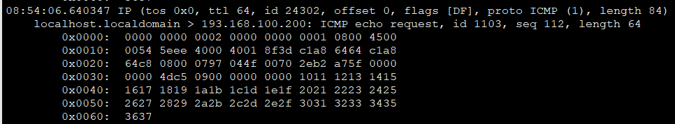
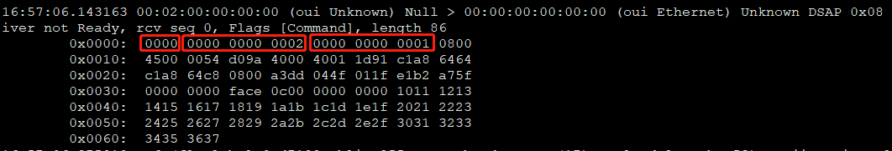

> #### vm-vm正常通信情况下，重启ovs服务后，vm-vm通信终端后未恢复

问题场景：
* 组网vm1 <-> vhost-user-1 <-> ovsdpdkbr <-> vhost-user-2 <-> vm2
* 创建vm-vm环境，vm-vm可以正常ping通。
* service openvswitch-switch restart
* vm-vm ping不通
* vm1: 193.168.100.100 00:00:00:00:00:01/vm2: 193.168.100.200 00:00:00:00:00:02

问题定位：

1.在vm1设置arp，先让报文从vm1发送出去。在vm1抓包看到发送出去的报文：
```
#tcpdump -i eth1 -xxxxvvvv
```


可以看到目的MAC，源MAC，源IP，目的IP都是正确的。

2.接着在主机上的vhost端口抓包：
```
#ovs-tcpdump -i vhost-user-1 -xxxxvvvv
```


可以看到在目的MAC前面多了2个字节的数据，导致整个数据包错位，这样的Ping报文到达vm2，vm2即便接收也无法给出回应。

3.猜测可能与virtio和vhost之间的共享空间存在某种程度的不对齐造成的，具体原因待定位。