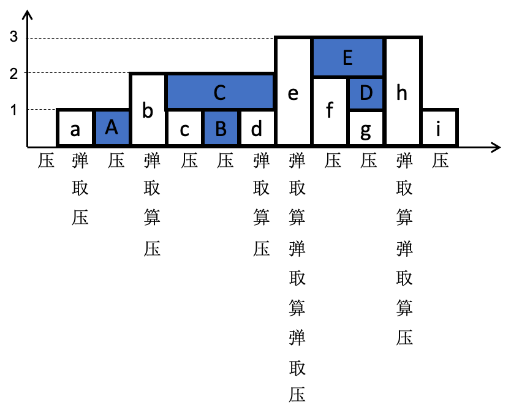

## 一、什么是单调栈

单调栈是指栈中的数据按递增/递减顺序存放。故单调栈通常分为单调递增栈和单调递减栈。

***单调递增栈：*** 栈中元素按递增顺序存放，通常用于求解数组中比当前元素小的下一个/前一个元素。  
***单调递减栈：*** 栈中元素按递减顺序存放，通常用于求解数组中比当前元素大的下一个/前一个元素。   

## 二、单调栈的应用
单调栈通常应用在数组中，应用中对于数组中每个元素，核心步骤为(以单调递减栈为例)：

* 栈非空，当前元素比栈顶大，弹出栈顶元素，开始处理数据。一直弹栈处理，直到栈空，或者比栈顶小。  
* 压栈 (满足单调递减特性)

#### *[\[leetcode-739\]](https://leetcode-cn.com/problems/daily-temperatures/) 每日温度*
*根据每日气温列表，请重新生成一个列表，对应位置的输入是你需要再等待多久温度才会升高超过该日的天数。如果之后都不会升高，请在该位置用 0 来代替。如：  
输入：[73, 74, 75, 71, 69, 72, 76, 73]  
输出：[1, 1, 4, 2, 1, 1, 0, 0]  
提示：气温列表长度的范围是 [1, 30000]。气温的值均为华氏度，都是在 [30, 100] 范围内的整数。*

如果采用直接求解，则对每个温度，遍历其后的每个元素，判断是否超过该日温度。这样求解的时间复杂度为O(n^2)。  
这个题目是典型的单调栈的应用，可以在O(n)时间复杂度内求解，不过对应的需要O(n)的空间复杂度。可以采用单调递减栈，对于每日温度，核心步骤为：

* 栈非空，该日温度比栈顶对应温度大，找到超过栈顶对应温度的第一个温度，弹栈，处理数据。一直弹栈处理，直到栈空，或者该日温度比栈顶对应温度小。  
* 压栈 (栈中温度单调递减，都还没找到比自身大的温度)   

```
/* Note: The returned array must be malloced, assume caller calls free(). */                                                                             
int *dailyTemperatures(int *T, int TSize, int *returnSize)                      
{                                                                               
    int *days = calloc(1, sizeof(int) * TSize);                                 
    int i = 0;                                                                  
    struct stack s;                                                             
    int top_day = 0;                                                            
                                                                                                                                     
    stack_init(&s);                                                             
    for (i = 0; i < TSize; i++) {                                               
        /* current element > top, just pop until current element < top */
        while ((!stack_empty(&s)) && (T[i] > T[touch_pop(&s)])) {               
            top_day = pop(&s);                                                  
            days[top_day] = i - top_day;                                        
        }                                                                       
        /* push, keep decrease stack */                                         
        push(&s, i);                                                            
    }                                                                           
                                                                                
    while (!stack_empty(&s)) {                                                  
        days[pop(&s)] = 0;                                                      
    } 
    *returnSize = TSize;   
    
    return days;                                                                
}   
```

#### *[\[leetcode-42\]](https://leetcode-cn.com/problems/trapping-rain-water/)接雨水*

*给定 n 个非负整数表示每个宽度为 1 的柱子的高度图，计算按此排列的柱子，下雨之后能接多少雨水。*


*上面是由数组 [0,1,0,2,1,0,1,3,2,1,3,1] 表示的高度图，在这种情况下，可以接8个单位的雨水（蓝色部分表示雨水），如：  
输入: [0,1,0,2,1,0,1,3,2,1,3,1]  
输出: 8*

这个题目也是用单调递减栈来求解，这里为了计算面积的方便，栈中保存的是对应柱子的下标。  



可以先只考虑只有一个接雨水的地方，如图中的b->c->d->e之间，那么，从b开始，对于递减的数压栈，则c和B对应的下标相继压栈。接着，碰到比栈顶大的数d，就出现了积水的地方B。此时积水的高度是c和d的低者和栈顶B对应数的差值，而宽度就是d和B下标的差值。因此，我们会弹出栈顶B对应的数，然后去计算积水B，然后d压栈。接着继续e的一系列动作。  
对于题目中给出的例子，在图中给出了完整的 { 弹(栈)/取(栈顶值)/算/压(栈) } 四个步骤的的过程。

```
int trap(int *height, int heightSize)                                           
{                                                                               
    int i = 0;                                                                  
    struct stack s;                                                             
    int area = 0;                                                               
    int bottom = 0;                                                             
    int top = 0;                                                                
    int idx_prev = 0;                                                           
                                                                                
    /* decrease stack */                                                        
    stack_init(&s);                                                             
    for (i = 0; i < heightSize; i++) {                                          
        while ((!stack_empty(&s)) && (height[i] > height[touch_pop(&s)])) {     
            /* pop */                                                           
            bottom = height[pop(&s)];                                           
            if (!stack_empty(&s)) {                                             
                /* touch top of stack */                                        
                idx_prev = touch_pop(&s);                                       
                top = height[i] < height[idx_prev] ? height[i] : height[idx_prev];
                /* calc */                                                      
                area += ((top - bottom) * (i - idx_prev - 1));                  
            }                                                                   
        }                                                                       
        /* push */                                                              
        push(&s, i);                                                            
    }                                                                           
                                                                                
    return area;                                                                
}   
```

## 三、总结
***单调递减栈：*** 碰到比栈顶小，压栈；碰到比栈顶大的，弹栈处理。  
***单调递增栈：*** 碰到比栈顶大，压栈；碰到比栈顶小的，弹栈处理。  
压栈的元素，可能直接是当前处理的数，也可能是下标。  
基本上可以用如下框架来完成单调栈(单调递减栈为例)：

```
for (i = 0; i < len; i++) {
	while (!stack_empty && (nums[i] > top_of_stack) {
		pop();
		...
	}
	push();
}
```

一般单调栈的应用需要一定的转换，如*[\[leetcode-1124\]](https://leetcode-cn.com/problems/longest-well-performing-interval/)表现良好的最长时间段*，就是通过转换成前缀和数组后，最后求解前缀和数组的最长上坡。
