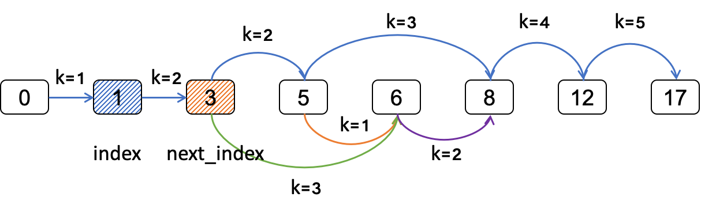

## 一、递归
递归通常用在可以把一个问题分解成子问题求解，最终由子问题的解可以合成问题的解。  
举个例子来理解递归，假如问题的解是[a0, a1, a2, ..., an]，那么用递归求解就是：

* 求解[a0]和[a1, a2, ..., an]；  
* 求解[a1]和[a2, a3, ..., an];  
* ...  
* 直到求解出[an]，最后由[a0], [a1], ..., [an]得到最终解。  

递归方法优缺点明显。  
优点：  

* 逻辑清晰，代码简洁。

缺点：  

* 递归层次较深时，函数调用多，性能较差。  
* 递归过程中会重复求解相同的子问题，性能较差。    
* 递归实质上是利用了系统栈的空间，如果层次较深，容易产生栈溢出。  

当然，对于重复子问题，可以通过申请一定的空间保存已经计算出来的子问题，从而提高性能。  

## 二、递归应用
递归在线性数据结构、树、图都有应用，涵盖较广。  
递归应用中通常伴随回溯，当然有时候是不需要回溯的。  
递归思想上可以用三板斧来思考：  

* 递归结束的条件。  
* 子问题求解。  
* 子问题求解完毕，是否需要回溯。       

在实际求解中，可以转换成如下三步：  

* 递归结束的条件。  
* options，广度上从哪里更进一步？递归函数参数总需要有一个index，来表示走到哪一步？  
* 是否需要回溯。  

### 线性数据结构中的递归应用
#### *[\[leetcode-46\]](https://leetcode-cn.com/problems/permutations/) 全排队*  
*给定一个没有重复数字的序列，返回其所有可能的全排列。  
输入: [1,2,3]  
输出: [[1,2,3], [1,3,2], [2,1,3], [2,3,1], [3,1,2], [3,2,1]]*   

首先分析题目，全排列数组，就是每次确定一个数，直到最后一个。  
   
如上图所示，第一个数可以选择1/2/3中的一个，第二个可以选择剩下的两个中的一个，最后就是剩下的那一个。  
按上述递归/回溯的思路：

* 递归结束的条件：最后一个数找到   
* options，确定这个数有哪些选择？那就是剩下的数里面选一个，然后继续下一个数的选择   
* 回溯，把上次选的数放回去，重新来选   

```
void permute(int *nums, int nums_size, int index, int **return_array, int *return_size)
{                                                                                  
    int i = 0;                                                                     
                                                                                   
    /* index indicates which step we arrived, ended position: final element */                                            
    if (index == nums_size) {                                                      
        return_array[*return_size] = calloc(1, sizeof(int) * nums_size);           
        memcpy(return_array[*return_size], nums, sizeof(int) * nums_size);         
        *return_size = *return_size + 1;                                           
        return;                                                                    
    }                                                                              
                                                                                   
    /* options: in permutations, what options does current "index" can be ? */  
    for (i = index; i < nums_size; i++) {  
		/* current "index" number set to be i-th number */
        swap(nums, index, i);                                                      
        permute(nums, nums_size, index + 1, return_array, return_size);       
        /* backtrace */                                                            
        swap(nums, index, i);                                                      
    }                                                                              
    return;                                                                        
}
```   
线性数据结构中使用递归/回溯，如*\[剑指offer-38\]字符串的排列，即输入一个字符串，
输出字符串的所有排列*。只是将上述题目中的数字换成字符。   
还有的题目需要增加每一步是否合法的判断，如*[\[leetcode-47\]](https://leetcode-cn.com/problems/permutations-ii/)
数字全排列，需要考虑重复排列*，这个就可以对数组先排序，如果current "index"跟上一个"index"的值一样，
那么意味着重复，需要排除，即在递归前多一个判断这一步是否要走。
*[\[leetcode-22\]](https://leetcode-cn.com/problems/generate-parentheses/)括号生成*，
也是需要增加合法性的判断，即对左括号和右括号个数的判断。

### 树中的递归应用
树型结构是递归天然的战场。对于树型结构的问题，通常都转化为求解其子树的问题。
树型结构里最经典的就是二叉树，下面我们就以二叉树为例子说明递归/回溯在树型结构中的应用。  
树型结构递归/回溯常见思路：  

* 递归结束条件：到达叶子节点
* options: 左子树和右子树，对于二叉树就这两种选择
* 回溯，是否需要回溯到父节点

#### *[二叉树的前序/中序/后序遍历]*   
*前序遍历*  

```
void preorder(struct tree_node *root)
{
	if (!root) {
		return;
	}

	visit(root->data);
	preorder(root->left);
	preorder(root->right);
}
```  

*中序遍历*

```
void inorder(struct tree_node *root)
{
	if (!root) {
		return;
	}

	inorder(root->left);
	visit(root->data);
	inorder(root->right);
}
```  

*后序遍历*   

```
void postorder(struct tree_node *root)
{
	if (!root) {
		return;
	}

	postorder(root->left);
	postorder(root->right);
	visit(root->data);
}
```  

几乎所有的二叉树的题目都是遍历树，那么就是前序/中序/后序遍历的变形。  

### 图中的递归应用
在图的题目中，最常用的搜索方法就是深度优先搜索(DFS)和广度优先搜索(BFS)。其中，
DFS使用递归/回溯方法实现，使得逻辑清晰，代码简洁。  

#### *[\[leetcode-79\]](https://leetcode-cn.com/problems/word-search/) 单词搜索*
*给定一个二维网格和一个单词，找出该单词是否存在于网格中。方向可以上下左右搜素，
网格字符不能重复*   

仍然是按照前面的三步走：

* 结束条件：搜索的单词完成了。  
* options：判断当前字符满足条件，往上下左右走一步。  
* 回溯：上下左右均没有满足，该字符放弃。  

```
int compare_word(char **board, int row, int col, int x, int y,
					char *word, int index, int **visited)
{                                                                                  
    /* ended position: index is last one */                                        
    if (index == (strlen(word))) {                                                 
        return 1;                                                                  
    }                                                                              
                                                                                   
    /* options */                                                                  
    if ((x >= 0) && (x < row) && (y >= 0) && (y < col)                             
        && (!visited[x][y]) && (word[index] == board[x][y])) {                     
        visited[x][y] = 1;                                                         
        if (compare_word(board, row, col, x + 1, y, word, index + 1, visited)   
            || compare_word(board, row, col, x, y + 1, word, index + 1, visited)
            || compare_word(board, row, col, x - 1, y, word, index + 1, visited)
            || compare_word(board, row, col, x, y - 1, word, index + 1, visited)) {
            return 1;                                                              
        }                                                                          
        /* backtrace */                                                            
        visited[x][y] = 0;                                                         
    }                                                                              
                                                                                   
    return 0;                                                                      
}
```

## 三、总结
解题三步走：  

* 结束条件
* options：往哪个方向走？
* 是否需要回溯？

子问题优化：

* 空间换时间，额外空间缓存已经求解的子问题

最后以优化的递归来结束递归/回溯章节

#### *[\[leetcode-403\]](https://leetcode-cn.com/problems/frog-jump/) 青蛙过河*
*一只青蛙想要过河。 假定河流被等分为 x 个单元格，并且在每一个单元格内都有可能放有一石子（也有可能没有）。 青蛙可以跳上石头，但是不可以跳入水中。给定石子的位置列表（用单元格序号升序表示）， 请判定青蛙能否成功过河（即能否在最后一步跳至最后一个石子上）。 开始时， 青蛙默认已站在第一个石子上，并可以假定它第一步只能跳跃一个单位（即只能从单元格1跳至单元格2）。如果青蛙上一步跳跃了 k 个单位，那么它接下来的跳跃距离只能选择为 k - 1、k 或 k + 1个单位。   
输入：[0,1,3,5,6,8,12,17]  
输出：true  
解释：
总共有8个石子。  
第一个石子处于序号为0的单元格的位置, 第二个石子处于序号为1的单元格的位置,  
第三个石子在序号为3的单元格的位置， 以此定义整个数组...  
最后一个石子处于序号为17的单元格的位置。    
青蛙可以成功过河：   
跳1个单位到第2块石子, 然后跳2个单位到第3块石子, 接着   
跳2个单位到第4块石子, 然后跳3个单位到第6块石子,   
跳4个单位到第7块石子, 最后，跳5个单位到第8个石子（即最后一块石子）。*  

按前面叙述的几个步骤：

* 结束条件：跳到了最后一个石子
* options：跳 k - 1, k, k + 1 三种可能性
* 不需要回溯，找到就说明存在，没找到就是不存在
* 优化

   

如图所示，假设青蛙从index跳k步到next\_index，那么只要判断从next\_index开始，经过k - 1, k, k + 1步能否到达终点。如果青蛙从index跳k步到达不了next\_index，那么到达不了。

重复子问题的优化，只需要用一个二维数组，保存从index跳k步能否到达终点。如果从index跳k步的子问题已经求解过了，则直接返回。否则需要递归求解，求解的结果保存在数组中。

```
/* cross(stones, stonesSize, 0, 1, cross_hist) */
int cross(int *stones, int stones_size, int index, int step, int **cross_hist)  
{                                                                               
    int stone = stones[index] + step;                                           
    int next_index = 0;                                                         
                                                                                
    /* ended position: step to last one */                                      
    if (stone == stones[stones_size - 1]) {                                     
        return CROSS_YES;                                                       
    }                                                                           
                                                                                
    /* optimize: had been solved */                                                       
    if (cross_hist[index][step] > CROSS_NONE) {                                 
        return cross_hist[index][step];                                         
    }                                                                              
                                                                                   
    /* next stone's position, -1 means cannot cross */                                                      
    next_index = next(stones, stones_size, stone, index);                          
    if (next_index < 0) {                                                          
        return CROSS_NO;                                                           
    }                                                                              
                                                                                   
    /* options: from next_index, jump k + 1, k, k - 1 steps */                                                               
    if ((cross(stones, stones_size, next_index, step + 1, cross_hist) == CROSS_YES)
        || (cross(stones, stones_size, next_index, step, cross_hist) == CROSS_YES)
        || (cross(stones, stones_size, next_index, step - 1, cross_hist) == CROSS_YES)) {
        cross_hist[index][step] = CROSS_YES;                                    
        return CROSS_YES;                                                       
    } 
    
    cross_hist[index][step] = CROSS_NO;                                         
    return CROSS_NO;                                                            
}          
```