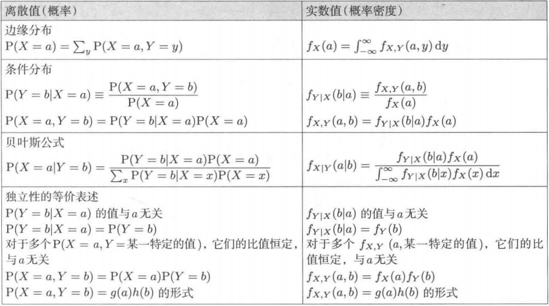

## 《程序员的数学1》 -结城浩

## 《程序员的数学2》 -结城浩
### 1. 条件概率
* 条件概率面积解释：P(Y=b|X=a) = P(Y=b, X=a)/P(X=a)，a中b的比例(given a, b's percent) = a中b的面积(联合概率) / a的总面积(边缘概率)

* 条件概率显然结论：P(Y=b0|X=a)+P(Y=b1|X=a)+...+P(Y=bn|X=a) = 1，b0...bn是所有Y的取值

* 贝叶斯作图：把总概率画成边长为1的正方形，把各种已知条件转化为面积画在图中，根据面积求解问题

* 贝叶斯公式：P(Y=b|X=a) = P(Y=b, X=a)/P(X=a) = P(X=a, Y=b)/P(X=a)
                       = P(X=a|Y=b) * P(Y=b)/(P(Y=b0, X=a) + ... + P(Y=bn, X=a))

* 事件独立性：X=a与Y=b独立 -> P(X=a, Y=b) = P(X=a) * P(Y=b)

### 2. 排列组合
* 排列(Permutation)：从n个人中选出k人排成一列，A(n, k) = n! / (n - k)!

* 组合(Combination)：从n个人中选出k人排成一列，不关心顺序，C(n, k) = A(n, k)/k! = n! / ((n - k)! * k!)

### 3. 期望/方差
* 期望值(Expectation)：期望值理解为体积，高度即值k, 面积即P[X=k], E[X] = k0 * P[X=k0] + ... + kn * P[X=kn]; E[X + c] = E[X] + c; cE[X] = c * E[X]; E[X + Y] = E[X] + E[Y]

* 方差(Variance)：V[X] = E[(X - u)^2], u = E[X]; V[X + c] = V[X]; V[c * X] = c^2 * V[X]

* 标准差(Standard deviation)：S[X]^2 = V[X]

* V[X] = E[X^2] - E[X]^2

* 条件方差：V[Y|X=a] = E[(Y-u(a))^2 | X=a], u(a) = E[Y|X=a]

### 4. 连续值概率
* 微分：书中以f(x)表示打印油墨的密度，F(x)表示打印油墨的使用量，x表示打印油墨的长度，f(x) = dF(x)/dx

* 积分：$\int_a^bf(x)dx = F(b) - F(a)$

* 连续值概率密度：f(X=x) = dF(X=x)/dx, F(X=a) = P(X<a)即直到a处的概率之和，f(X=x)的值越大，表示x附近的概率越浓，x附近的值出现的概率越大。因此，$P(a<x<b) = \int_a^bf(x)dx$

* 均匀分布， f(x) = 1/(b - a)

* 联合分布：

* 离散概率 vs 连续概率：

* 正态分布/中心极限定理

### 5. 协方差/多元正态分布
* 协方差(Covariance)：Cov(X, Y) = E[(X-u)(Y-v)], u = E[X], v = E[Y]，表明X与Y的相关性

* 多元正态分布

* 卡方分布

### 6. 估计与检验
* 最小方差无偏估计

* 最大似然估计

* 贝叶斯估计

### 7. 伪随机数

### 8. 概率论的各类应用

* 最小二乘拟合直线

* 随机游走

* 卡尔曼滤波器

* 马尔可夫链

* 熵

* 信道编码