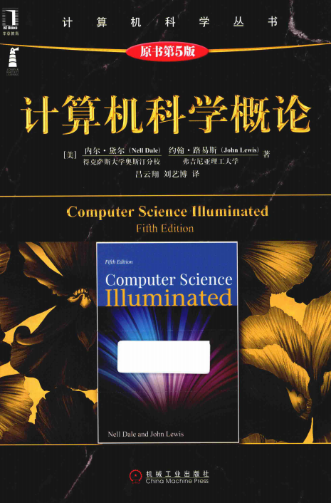

## [计算机科学概论](https://book.douban.com/subject/1435554/)

### 第一章 计算机全景
* 用户概念进化：
    * 程序设计员：编写程序解决自己或者他人问题
    * 系统程序员：为其他程序员编写越来越复杂的工具
    * 计算机用户：应用程序员为广大非程序员用户编写用户友好的应用软件

* 2001年计算学科主题领域：

### 第二章 二进制

### 第三章 数据表示法
* 二进制负数补码：negative(I) = 2 ^ k - I，或者按位取反加1（符号位不变）

* ASCII (American Standard Code Information Interchange), 8位表示256种字符

* Unicode字符集，一般16位，扩充非英文字母的符号，前256与ASCII保持一致

* Huffman encoding：变长二进制串表示字符，使常用字符具有较短的编码

### 第四章 门与电路

### 第五章 计算部件
* 冯诺伊曼体系结构：
    * 内存单元
    * 算术逻辑单元(ALU, Arithmetic Logic Unit): 加减乘除/比较
        * 寄存器(register)：现代ALU上的特殊存储单元
    * 输入/输出单元(I/O Unit)
    * 控制单元(control unit)：控制读取-执行周期
        * 指令寄存器(IR, Instruction Register): 存放当前正在执行的指令的寄存器
        * 程序计数器(PC, Program Counter): 存放下一条要执行的指令的地址的寄存器

* ALU与控制单元合称中央处理器(CPU, Central Processing Unit)

### 第六章 程序设计语言
* 机器语言
* 汇编语言
* 高级语言
* 算法 -> 伪代码 -> 代码实现

### 第七章 问题求解与算法设计
1. 如何解决问题
* 提出问题
* 寻找熟悉的情况
* 分治法
* 算法
* 计算机问题求解：
    * 分析/说明问题
    * 开发/测试算法：解决方案的逻辑方案
    * 编码/测试：程序设计语言翻译算法
    * 使用/维护

2. 设计思想
* 信息隐蔽(information hiding): 高层设计时隐蔽低层的细节。这样低层细节的改变不会影响高层的设计。
* 抽象(abstraction)：抽象是信息隐蔽的结果

### 第八章 抽象数据类型与子程序
### 第九章 面向对象设计与高级程序设计语言
* 高级程序设计语言
    * 编译型，需要编译器翻译成机器码
    * 解释型，解释器在翻译过语句后直接执行语句，可以理解为解释器是这类高级语言的模拟器

* 命令式范型(pattern?)
    * 面向过程
    * 面向对象

* 声明式范性
    * 函数式模型
    * 逻辑编程

### 第十章 操作系统
* 内存管理
    * 单块内存管理
    * 固定分区内存管理
        * 最先匹配
        * 最优匹配
    * 动态分区内存管理
        * 最差匹配
    * 页式内存管理

* CPU管理
    * 周转周期：进程进入准备就绪到最终完成之间的时间间隔。系统平均周转周期越小越好。
    * 先到先服务
    * 最短作业优先
    * 轮询服务

### 第十一章 文件系统和目录

### 第十二章 信息系统
* 数据库管理系统

### 第十三章 人工智能
* 语义网(semantic network)：表示对象之间关系的知识表示法

* 检索树(search tree)：表示对抗性情况（如博弈）中的所有选择的结构

### 第十四章 图形学

### 第十五章 网络

### 第十六章 万维网

### 第十七章 计算机安全
* 信息安全：保密性(confidentiality)/完整性(integrity)/可用性(availablility)

### 第十八章 计算的限制